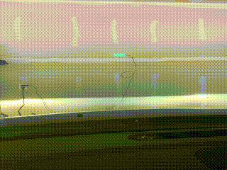

# Parking Sensor

I have a small garage. When I'm parking a large car, unless I pull far enough into the garage, I can't shut the garage door. 

Practically, there are two good solutions for this problem: put a 2x4 where the front wheels should stop, or hang a tennis ball to touch the windshield when you've pulled in far enough.

What's the fun in *that*? Instead, I have a [Raspberry Pi Pico](https://www.raspberrypi.com/products/raspberry-pi-pico/), a handful of [WS2812B](https://www.amazon.com/gp/product/B01CDTEG1O/) self-addressable LEDs, a fancy [VL53L1CX](https://www.adafruit.com/product/3967) time of flight sensor, and some free time on my hands. So, let's make a stop light.

## Things I learned

1. **Some math and colors**. I got very excited for a while about the idea of fading from green to red. I ended up not doing that because, as a user, I wanted a more definitive signal that I should stop. But in the process, I had a moment of clarity where, instead of hardcoding in colors associated with distances with an if-elif-else loop, I could just use trigonometry! This was a little challenging though because, as it turns out I needed to go from RGB color model to an [HSL] model. Then, as the distance went down, I could decrease from a hue of 0.333 to a hue of 0, while holding the SL versions constant. To make this work, I needed [to convert RGB to HLS](np.py#L21) so that I could use the built-in neopixel library. Fortunately, the main Python library had this function in the `colorsys` library, so I borrowed that! Again, though, none of this was all that relevant.  

2. **The MicroPython and CircuitPython split is unfortunate**. As I sit here and write this, I don't really understand how to write libraries for these sensors. But I do know that there are two parameters that you can set for a VL53L1X, and in the [library I borrowed](https://github.com/drakxtwo/vl53l1x_pico/), I couldn't set those parameters. By contrast, in the [CircuitPython library](https://docs.circuitpython.org/projects/vl53l1x/en/latest/), you totally can set those parameters. I tried to port everything to CircuitPython but then I couldn't get the LEDs to work. So I ended up abandoning the whole effort, and just hoping that the parameters wouldn't matter all that much. But throughout, I kept thinking: "gosh, it'd be nice if MicroPython and CircuitPython were just one thing instead of two totally different things." I get *why* they're different, but it's a shame.

3. **Connections and PCBs**. Perhaps the biggest challenge for me was getting from prototype in a breadboard to something I could put on the wall. I ended up using a fair amount of [JST connectors](https://en.wikipedia.org/wiki/JST_connector) and electrical tape to make everything work. I also went down weird rabbit holes around custom PCBs and basically think that there needs to a whole blog post on how this should work. In the end, the connectors was probably the right call, but I should have actually spent a few more minutes making sure I had the right connectors for wire-to-wire connections. 